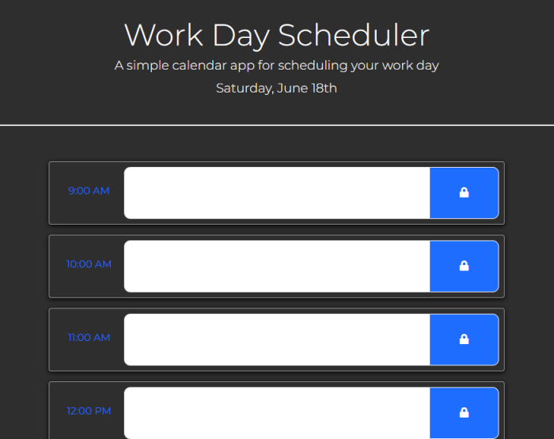

# Calender App

This is a simple calendar app for scheduling your work day! It saves messages in each block event when you click the lock button to localstorage. And depending of the time of day, each block will be color coordinated to show if it's in the future, past, or present.

